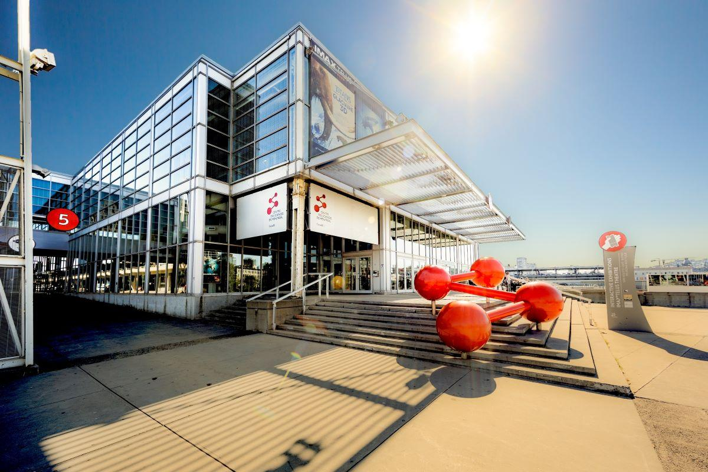
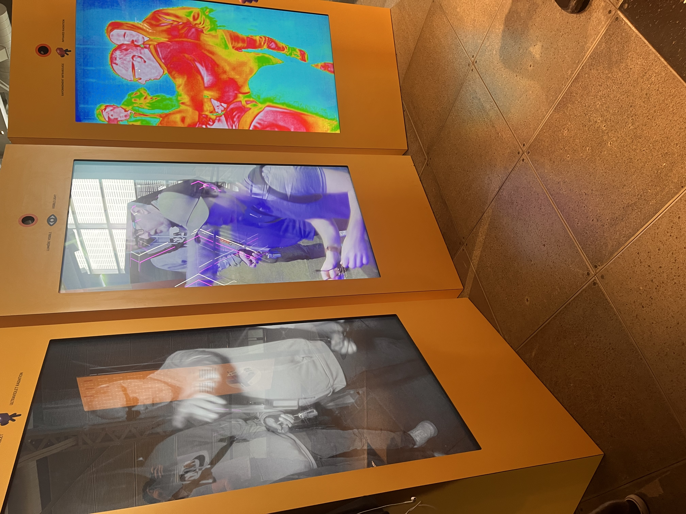
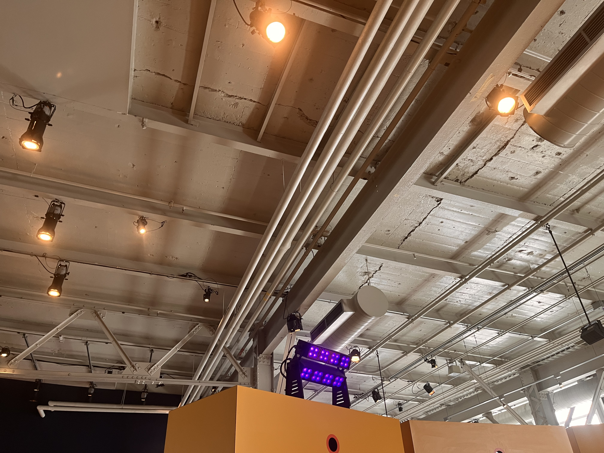
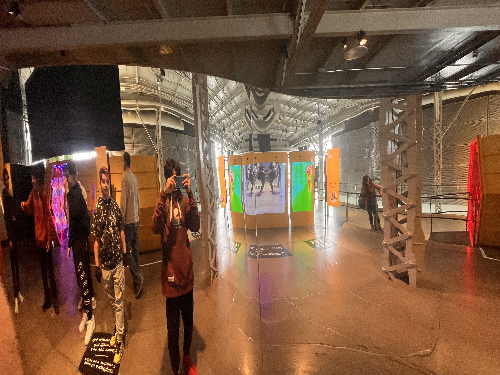

# Nom de l'exposition
Humain

Photo prise par Mateo El-Helou durant l'expo

# Lieu de mise en exposition

Centre de Sciences

photo prise que j'ai pris: https://www.centredessciencesdemontreal.com/exposition-permanente/explore

# Type d'exposition
Temporaire, intérieure, multimédia

# Date de ma visite
Merdredi 10 Avril 2024

# Titre de l'oeuvre
Voir l'invisible

# Nom de l'artiste

# Année de réalisation
8 octobre 2015

# Description de l'oeuvre
- 3 Écrans qui te permet de percevoir ce qu’on ne voit pas a l’oeil nu
- a première est en noir et blanc et qui permet le rayonnement ultra violet et la caméra doit te capter
- La deuxième c’est juste avec un lumière visible plus clair
- La troisième est un camera infrarouge qui permet de te capter et de voir la chaleur de ton corps

# Type d'installation

- Écrans des boite jaune pour les retenir droits
- 3 écrans larges
- Cameras

# Mise en espace

# Composantes et techniques
- 3 écrans
- 3 différente caméra dont on ne l'on voit pas la même chose sur les 2 écrans
- Disposition d'une lumièer mauve sur ledessus du premier écran
  

Vidéo prise par Mateo El-Helou durant l'expo

# Éléments nécessaires à la mise en exposition

# Expérience vécue

- Vivre l'expérience amusante
- Observer les different efftes que la caméra te présente sur soi-même
- effet radiation ultravioet, effet lumière visible et l'effet rayonnement infrarouge

# ❤️ Ce qui m'a plu
- comment je peut me voir avec 3 differentes caméra qui donne trois difféerents effets
- les type d'effets
- De pouvoir m'amuser à bouger devant les écrans et de pouvoir regarder les différents effts que les 3 caméra donne sur moi

# 🤔 Aspect que je souhaite pas retenir pour mes propres créations ou que je ferez autrement et justifications
- Celle de milieu, caméra dont c'est une caméra qui permet de voir avec une lumière visible. Je trouvais que c'était simple pour celui-là

