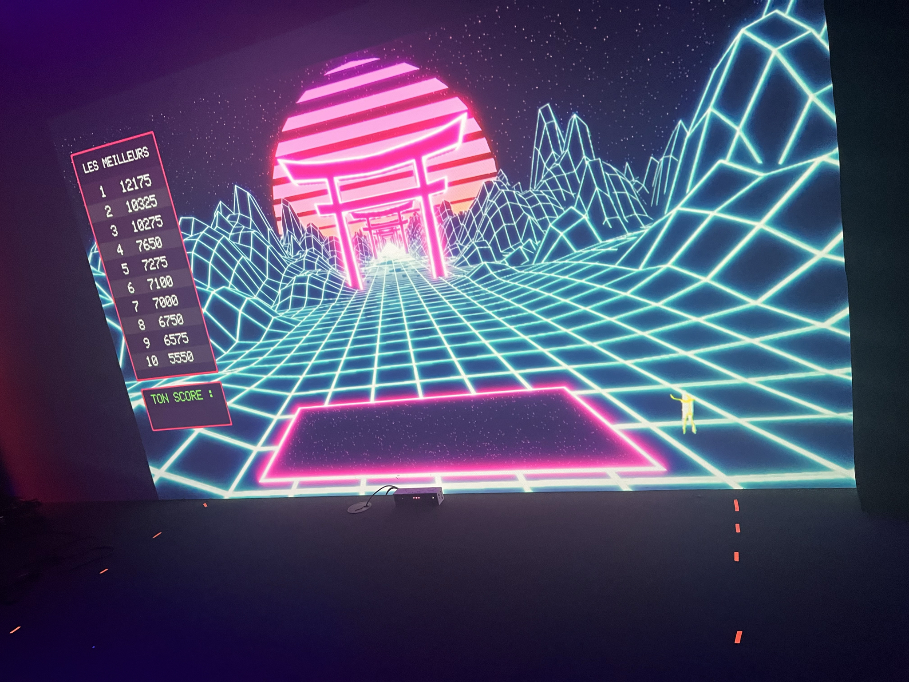

Le projet que j'ai aimée, que j'ai adoré et qui me passione c'est le je projet Kigo

 # Projet Kigo

1.
- Ramasser les X et éviter les rectangle (obstacles)
- Vitesse aiment à chaque fois rapidement
- Plus vitesse plus difficulté par aléatoire
- Modélisation 3D
- Peut jouer à deux
- Kinect scan to squelette qui permet que quand tu bouge dans l’écran tu bouge
- Programmer avec Unity
- Nouvelle mis de jeu/ nouveau background, personne sur une plateforme dans le jeu, des points (+25, +50, +75 et +100 points) ce qui augmente to score
- À la fin du jeux il y’a une barre de tout les score et avec ton score

# justification (avant/après l'expérimentation

- Ce que j'ai aimé dans cette oeuvre avant c'tait l'arrière-plan du jeu et mais il y avais pas beaucoup de décoration dans l'arrière-plan
- Plus vitesse plus difficulté par aléatoire c'est ce qui rend le jeu plus interessant 
- À la fois, c'est un jeu dont l'utilisation de la Kinnect alrs c'e quee j'aime aussi car il y a de l'action

Photo durant ma visite

