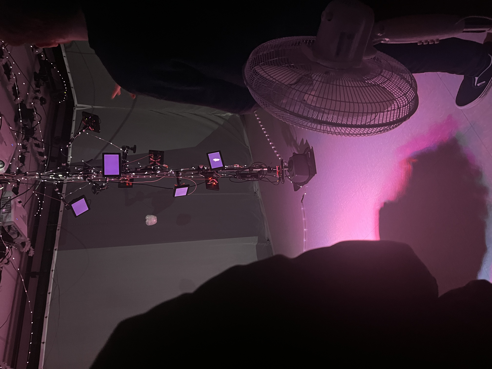
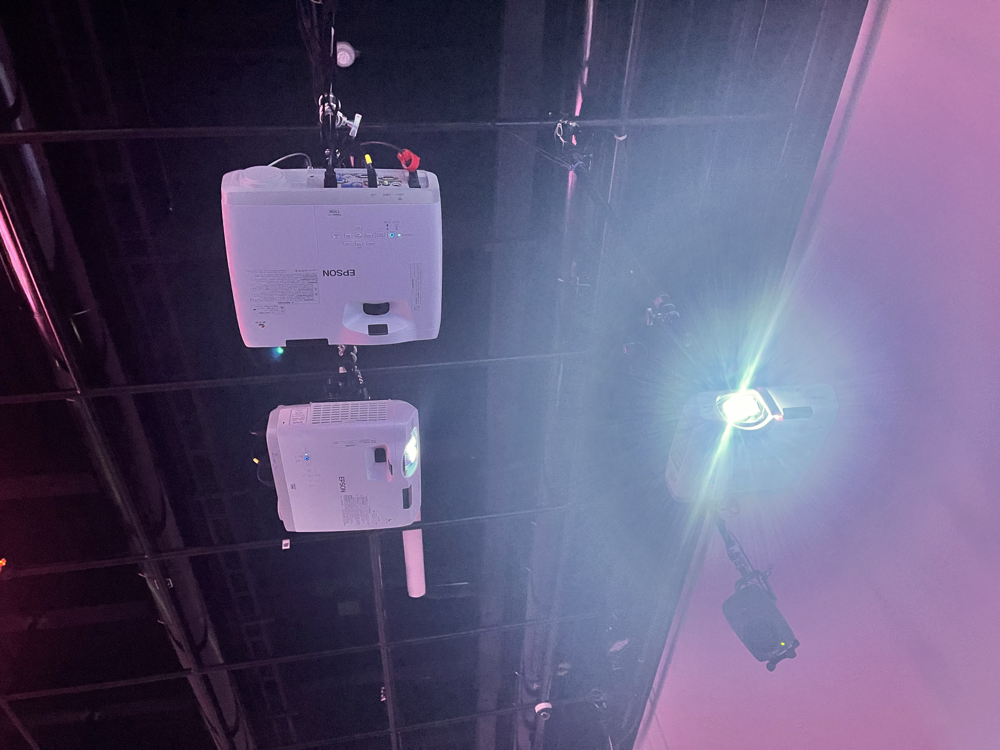
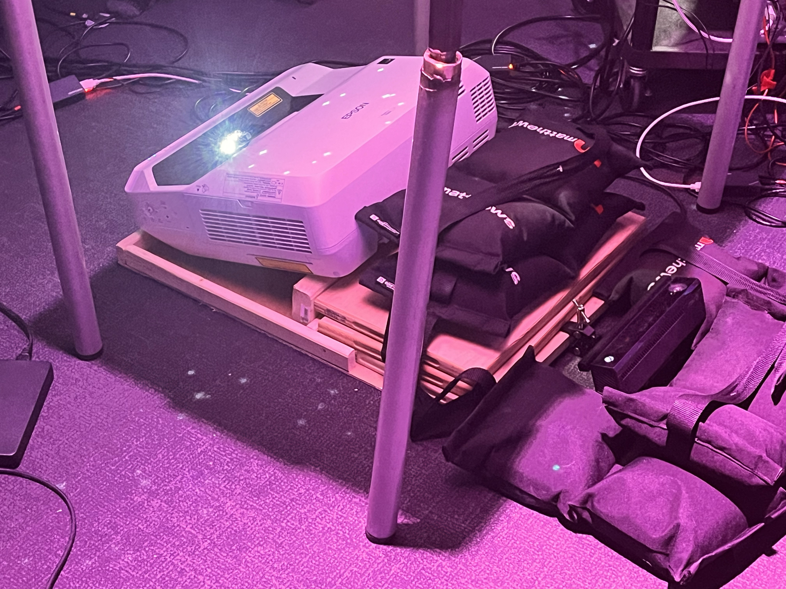

# Nom de l'exposition
Crescentia

# Lieu de mise en exposition
Présentée dans le grand studio et dans le petit studio au collège Montmorency

# Date de mes visites
Le mercredi 21 février à la semaine 5 et le mercredi 13 mars à la semaine 7

# Nom de l'artiste
Finissants de 3e année de TIM

# Description des oeuvres

# Première oeuvre: Kigo

RÉALISATEURS / RÉALISATRICES
- Érick Ouellette
- William Rathier Mailly
- Gabriel Clerval
- Nicolas St-Martin
- Antoine Dion

DESCRIPTION
- Ramasser les X et éviter les rectangles (obstacles)
- Vitesse augmente rapidement à chaque fois
- Plus de vitesse ammène plus de difficulté, mais aléatoirement
- Modélisation 3D
- Peut se jouer à deux
- Kinect scan ton squelette ce qui permet que tu bouges sur l’écran
- Programmé avec Unity
- Durant la deuxième visite, j'ai remqrqué que la mise en jeu avait un nouveau background et une plateforme sur laquelle on se met debout dans le jeu
- Les créateurs ont ajouté aussi des points (+25, +50, +75 et +100 points) pour marquer un score - à la fin du jeu il y’a une barre qui marque tous les scores

TYPES D'INSTALLATIONS
- Unity
- Kinect
- projection sur le mur

  
LIEN AVEC CRESENCIA
- Évoluer dans la compétition en évitant les obstacles avec une évolution des backgrounds

MON EXPÉRIENCE
- Dans l'action, ça bouge, j'aime ça

↓ cliquez pour visonner video youtube ↓

# Deuxième oeuvre: Canevas Cosmique

RÉALISATEURS / RÉALISATRICES
- Jacob Alarie-Brousseau
- Étienne Charron
- Jérémy Cholette
- Quoc Huy Do
- Mikaël Tourangeau

DESCRIPTION
- Génère les effets des planètes et du trou noir sur écran avec un papier
- Projeté sur un écran sur le mur
- Jetons imprimés 3D avec imprimante 3D
- Chaque statue (jeton) produit un effet sur le soleil

TYPES D'INSTALLATIONS
- Projecteurs
- Unity
- Dectection infrarouge sur du papier, collés sous les jetons de statuettes
- Utilisation des sons de tous les jours de la vie
  
LIEN AVEC CRESENCIA
- Simuluation interactive et evolutive du mouvement des planètes

MON EXPÉRIENCE
- Très bonne approche de faire bouger les jetons et voir les effets que cela produit

# Troisième oeuvre: Rhizomatique

RÉALISATEURS / RÉALISATRICES
- Jolyanne Desjardins
- MaÏka Désy
- Laurie Houde
- Felix Testa Radovanovic

TYPES D'INSTALLATIONS
- Projection sur une toile
- Toile graphique

DESCRIPTION
- Une projection sur une toile qui scanne en infrarouge ta main quand tu la presses sur la toile
- Noir et blanc durant la première visite - en couleurs durant la deuxième visite
- Maintenant quand tu touches avec ta main sur la toile, sur l’écran mapping, ça génère des images souvenirs de la vie

LIEN AVEC CRESENCIA
- Retour dans le passé avec les souvenirs

MON EXPÉRIENCE
- Tactile, interactive, sucite la curiosité

# Quatrième oeuvre: Sonalux

RÉALISATEURS / RÉALISATRICES
- Antoine Haddad
- Camélie Laprise
- Ghita Alaoui
- Vincent Desjardins

DESCRIPTION
- Génération visuelle
- Traitement visuel mapping
- Programmation
- Appuyer sur les touches qui générent des sons calmes et parfois forts
- Développements graphiques visuels
- Jouer avec les sons
- Écouter les sons générés

TYPES D'INSTALLATIONS
- Écrans mini ordinateurs
- TouchDesigner
- VCV Rack
- Arduuino
- Kinect v.1.8 studio

LIEN AVEC CRESENCIA
- Voyage astral immaginatif

MON EXPÉRIENCE
Très auditive, j'ai apprécié les sons et la modification en interagissant avec les touches

# Cinquième oeuvre: Effet-Papillon

RÉALISATEURS / RÉALISATRICES
- Raphaël Dumont
- Alexis Bolduc
- William Morel
- Alexia (Ryan) Papanikolaou
- Viktor Zhuravlev
- Jasmine Lapierre

DESCRIPTION
- Évolution d'une plantation
- Exemple d'interaction: tirer une corde et des effets qui apparaissent par les projections visuelles
- Interactions qui permettent dans le logiciel de détecter les lumières par les interactions utilisées
- Sons multiples pré-enregistrés

TYPES D'INSTALLATIONS
- Magic arm
- Raspberry Pi
- Rideaux avec projections
- (Mdi) moyen de communication

LIEN AVEC CRESENCIA
- Croissance d'une pommier

Avant
 

Après

MON EXPÉRIENCE
- Interagir avec des objets et expérimenter l'effet papillon de transformation

# 3 cours du programme semblent incontournables pour avoir les compétences pour créer ce genre projet

1. Web
  Il y a beaucoup de programmation dans les oeuvres que les finissants de 3e année de TIM ont réalisés.
  Dans chaque projet réalisé, le codage est requis  pour faire fonctionner certaines de ces oeuvres.
  Par exemple: le projet de Sonalux ^pour le fonctionnement des boutons, et celui du Kigo puisque c'est un jeu sur une Kinect.

2. Audio
   Dans beaucoup de ces projets réalisés par les finissants de 3e année de TIM, il y énormément de sons et de musique et c'est graĉe au cours d'audio qu'ils ont pu réalisé cela.
   Les sons sont des objet de la la vie de tous les jours comme par exemple dans le projet du Canevas Cosmique pour faire les sons des planètes et du trou noir.
   Dans Sonalux aussi les sons qu'on entend dans le casque d'écoute sont essentiels. Pour le projet Rhizomatique, les sons calmes permettent de vivre l'expérience.

4. Domaines multimédias
   Dans certaines de ces oeuvres réalisées, il ya beaucoup d'aspects des domaines multimédia notamment dans Rhizomatique avec la toile qui fait en sorte qu'en appuyant l'interacteur
   qui le fait se déplacera dans le cerveau pour appercevoir ses souvenirs, qui vont être par la suite scanner sur des projections immersives

# présentation d'une technique* ou une composante technologique* qui sera utilisée dans l'un des projets et que vous ne connaissiez pas

La kinnect, parce que je me suis renseigné plus sur cette technique à l'aide des des étudiants finissants de 3e année de TIM à qui j'ai posé beaucoup de questions à propos du fonctionnement de la Kinnect dans leur oeuvres.

Selon la source https://www.lepoint.fr/high-tech-internet/kinect-comment-ca-marche-10-11-2010-1260819_47.php#11: Kinect est composé de trois optiques : deux caméras 3D infrarouges, qui représentent la salle de jeu sous forme d'un quadrillage qui gère la profondeur de champ, et une caméra couleur RVB pour filmer. Kinect doit être placé sur un support stable, le dessus du téléviseur est clairement à proscrire, car son pied est motorisé et s'actionne à chaque démarrage. Grâce à ce mouvement vertical, le capteur scanne son environnement et peut donc s'adapter à toutes les pièces, ainsi qu'à la taille des joueurs. Mais attention : Kinect est gourmand en place et les joueurs devront sûrement déplacer quelques meubles pour satisfaire son besoin d'espace. Microsoft annonce un recul minimum de 1,80 mètre pour jouer seul, et de 2 mètres pour deux participants, mais en réalité, il en faudra un peu plus pour être vraiment à l'aise et ne pas régulièrement avoir de messages d'erreur en cours de partie.
