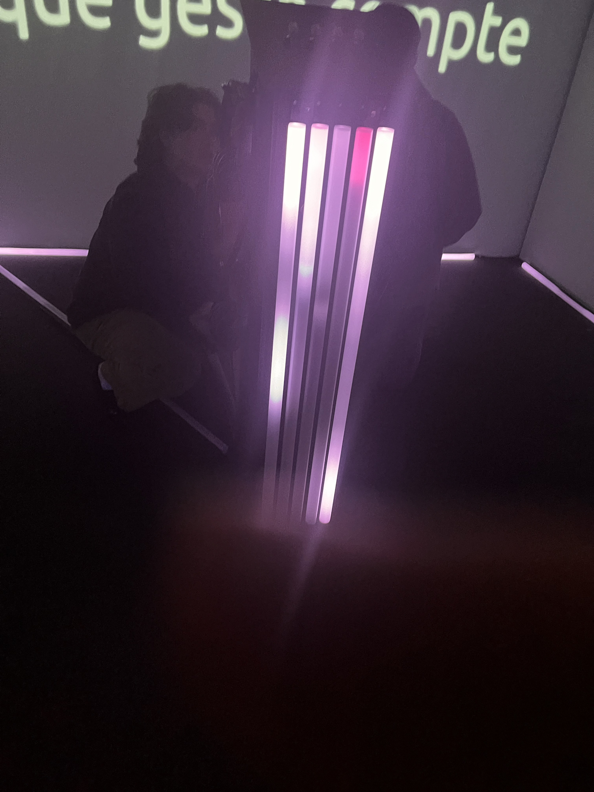
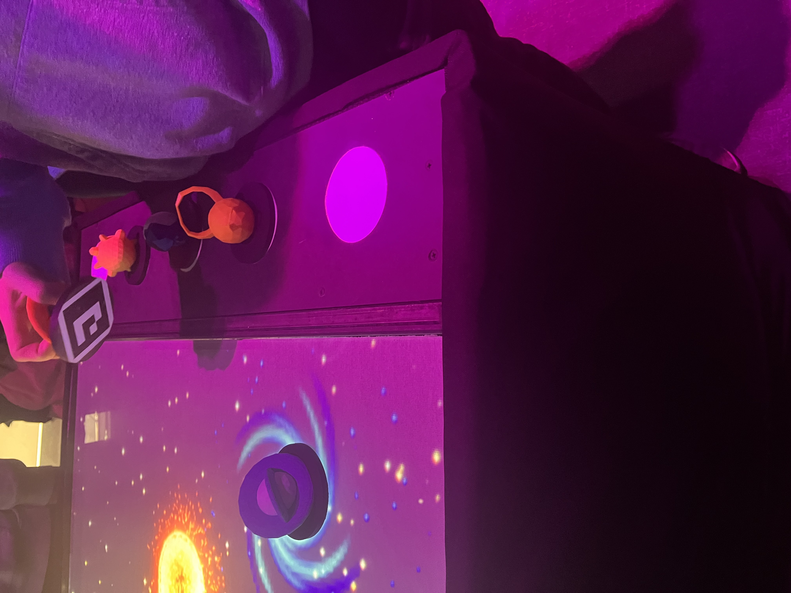
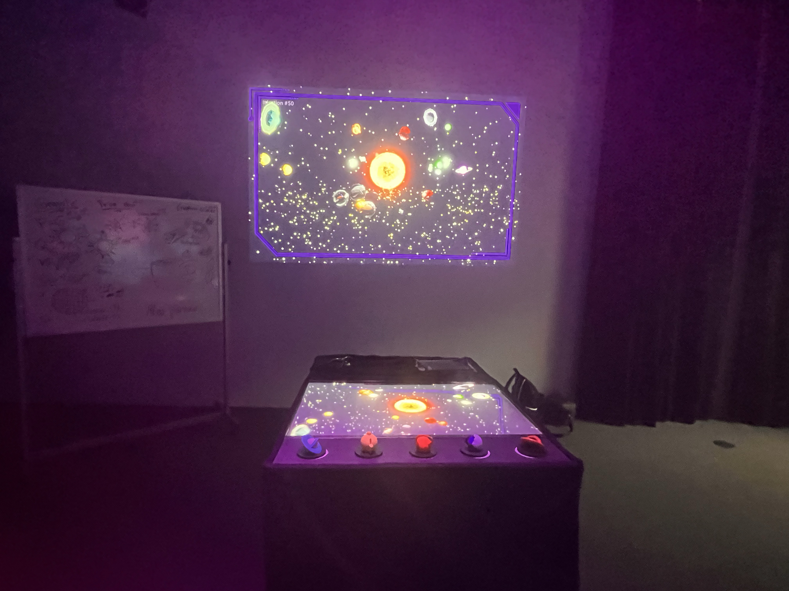
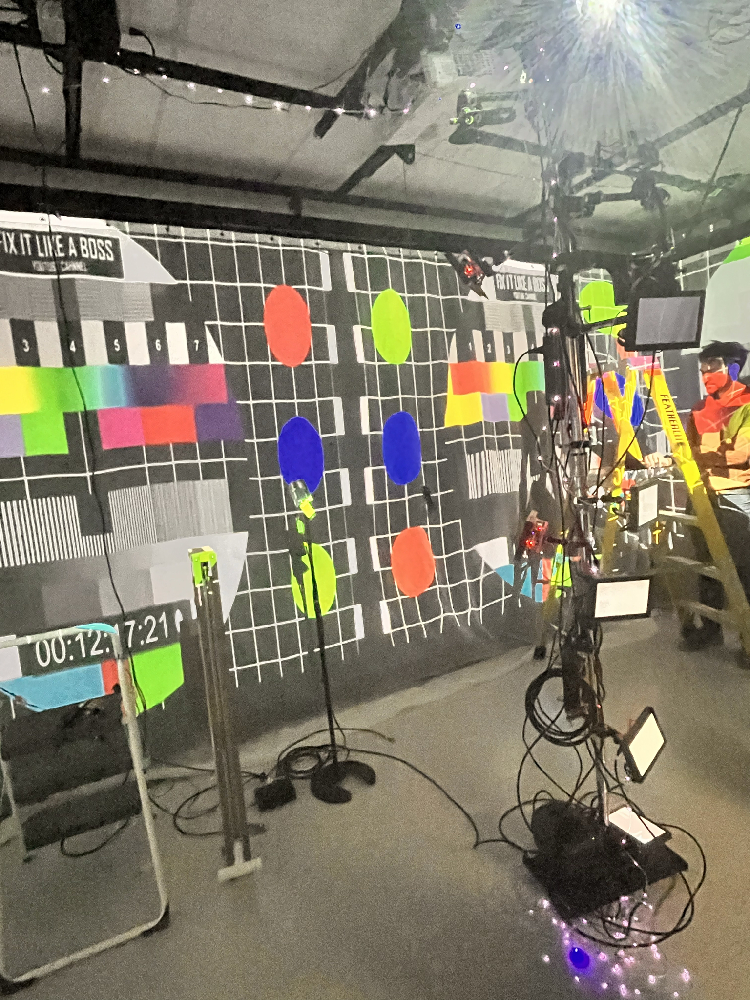
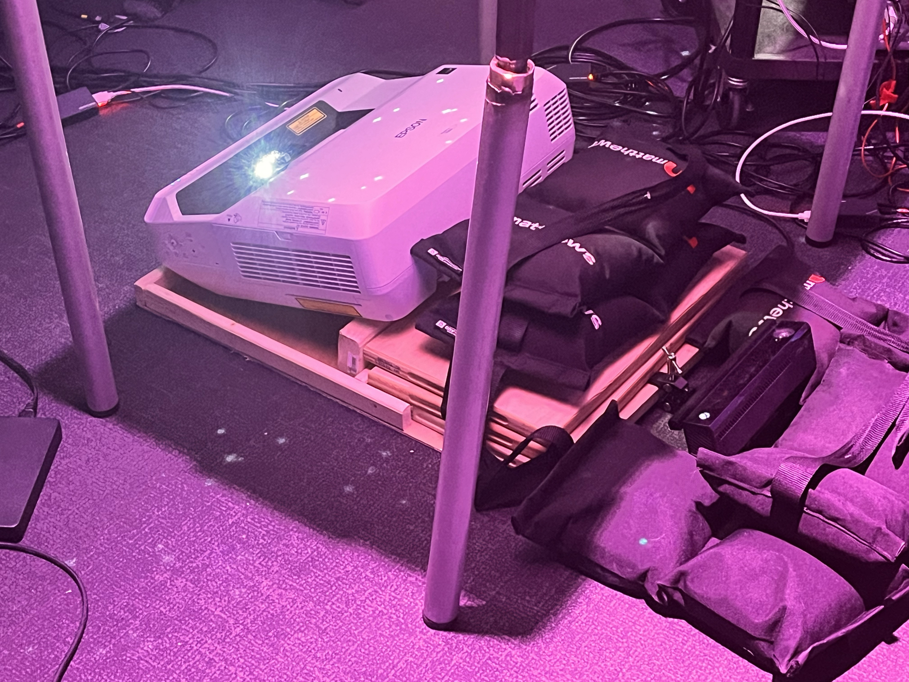

# Nom de l'exposition
Crescentia

# Lieu de mise en exposition
Présentée dans le grand studio et dans le petit studio au collège Montmorency

# Date de ma visite
Le Mercredi 21 Février à la semaine 5 et le Mercredi 13 mars à la semaine 7

# Nom de l'artiste
Finissants de 3e année de TIM

# Description de l'oeuvre

première oeuvre: Kigo

1.
- Ramasser les X et éviter les rectangle (obstacles)
- Vitesse aiment à chaque fois rapidement
- Plus vitesse plus difficulté par aléatoire
- Modélisation 3D
- Peut jouer à deux
- Kinect scan to squelette qui permet que quand tu bouge dans l’écran tu bouge
- Programmer avec Unity
- Nouvelle mis de jeu/ nouveau background, personne sur une plateforme dans le jeu, des points (+25, +50, +75 et +100 points) ce qui augmente to score
- À la fin du jeux il y’a une barre de tout les score et avec ton score

# Réalisateurs/Réalisatrices
- Érick Ouellette
- William Rathier Mailly
- Gabriel Clerval
- Nicolas St-Martin
- Antoine Dion

↓ cliquez pour visonner video youtube ↓

Deuxième oeuvre: Rhizomatique

2.
- Kinect ou c’est un projection sur une toile qui scan infrarouge ta main quand tu presse ta main sur la toile
- Noir et blanc
- Maintenant quand tu touches avec ta main sur la toile, sur l’écran mapping, ça génère des images de la vie

# Réalisateurs/Réalisatrices

- Jolyanne Desjardins
- MaÏka Désy
- Laurie Houde
- Felix Testa Radovanovic

  
troisième oeuvre: Sonalux

3.
- Générerion visuel
- Traitement visuel mapping
- Programmation
- Appuyer sur les touches qui génére des sons calmes et parfois forts
- Développement graphique
- Jouer avec les sons
- Écouter les sons générés

# Réalisateurs/Réalisatrices

- Antoine Haddad
- Camélie Laprise
- Ghita Alaoui
- Vincent Desjardins
  

quatrième oeuvre: Canevas Cosmique

4.
- Génère des effets et de planètes et trou noir sur écran avec un papier
- Projeter sur un écran sur le mis
- Jetons (avec impression 3D/imprimante 3D
- Chaque statues (jetons) fait un effet sur le soleil

# Réalisateurs/Réalisatrices

- Jacob Alarie-Brousseau
- Étienne Charron
- Jérémy Cholette
- Quoc Huy Do
- Mikaël Tourangeau

cinquième oeuvre: Effet-Papillon

5.
- Effets papillons
- Projet final de techniques
- Tirer un corde et des effets qui apparaissent par les projections
- Visuels
- Interactions qui permettent
- Dans le logiciel qui lui détecte lumière par les interactions utilisées
- Sons

# Réalisateurs/Réalisatrices

- Raphaël Dumont
- Alexis Bolduc
- William Morel
- Alexia (Ryan) Papanikolaou
- Viktor Zhuravlev
- Jasmine Lapierre

# Type d'installation
- Magic arm
- Raspberry Pi
- Rideaux avec projections
- Projecteurs
- Écrans mini ordinateurs
- (Mdi) moyen de communication
- Dectections infrarouge sur les papiers qui sont deetecter par des le codage des symbole le sur les bout de papiers sur ordinateurs
Sons avec des sont de tout les jours
- Unity
- Kinect ou c’est un projection sur une toile
- toile graphique

↓ cliquez pour visonner video youtube ↓

Vidéo prise par Mateo El-Helou durant l'expo

# Mise en espace
- Bancs pour s'asseoir et contempler les écrans
- Musiques et sons à volume élevé
- Espaces sombres éclairés uniquement par les écrans

Croquis desiné par Mateo El-Helou durant l'expo

# Composantes et techniques
- 2 écrans larges et 3 qautres oeuvre projetés sur un mur
- Projecteurs et ordinateurs connectés
- Système sonore

  
↓ cliquez pour visonner video youtube ↓

Vidéo prise par Mateo El-Helou durant l'expo

# Éléments nécessaires à la mise en exposition
- les murs pour la projection de quelques oeuvres
- Projecteurs et spots lumineux fixés au plafond
- Cablages bien couverts
- ordinateurs
  

Photo de https://flash---art.com/article/jeremy-shaw-phase-shifting-index-centre-pompidou-paris/

# 3 cours du programme semblent incontournables pour avoir les compétences pour créer ce genre projet

1. Web
  Il y a beaucoup de programmation dans les oeuvres que les finissants de 3e année de TIM ont réalisés.
  Dans chaque projet réalisé, le codage est requis  pour faire fonctionner certaines de ces oeuvres.
  Par exemple: le projet de Sonalux ^pour le fonctionnement des boutons, et celui du Kigo puisque c'est un jeu sur une Kinect.

2. Audio
   Dans beaucoup de ces projets réalisés par les finissants de 3e année de TIM, il y énormément de sons et de musique et c'est graĉe au cours d'audio qu'ils ont pu réalisé cela.
   Les sons sont des objet de la la vie de tous les jours comme par exemple dans le projet du Canevas Cosmique pour faire les sons des planètes et du trou noir.
   Dans Sonalux aussi les sons qu'on entend dans le casque d'écoute sont essentiels. Pour le projet Rhizomatique, les sons calmes permettent de vivre l'expérience.

4. Domaines multimédias
   Dans certaines de ces oeuvres réalisées, il ya beaucoup d'aspects des domaines multimédia notamment dans Rhizomatique avec la toile qui fait en sorte qu'en appuyant l'interacteur
   qui le fait se déplacera dans le cerveau pour appercevoir ses souvenirs, qui vont être par la suite scanner sur des projections immersives

# présentation d'une technique* ou une composante technologique* qui sera utilisée dans l'un des projets et que vous ne connaissiez pas

La kinnect, parce que je me suis renseigné plus sur cette technique à l'aide des des étudiants finissants de 3e année de TIM à qui j'ai posé beaucoup de questions à propos du fonctionnement de la Kinnect dans leur oeuvres.

Selon la source https://www.lepoint.fr/high-tech-internet/kinect-comment-ca-marche-10-11-2010-1260819_47.php#11: Kinect est composé de trois optiques : deux caméras 3D infrarouges, qui représentent la salle de jeu sous forme d'un quadrillage qui gère la profondeur de champ, et une caméra couleur RVB pour filmer. Kinect doit être placé sur un support stable, le dessus du téléviseur est clairement à proscrire, car son pied est motorisé et s'actionne à chaque démarrage. Grâce à ce mouvement vertical, le capteur scanne son environnement et peut donc s'adapter à toutes les pièces, ainsi qu'à la taille des joueurs. Mais attention : Kinect est gourmand en place et les joueurs devront sûrement déplacer quelques meubles pour satisfaire son besoin d'espace. Microsoft annonce un recul minimum de 1,80 mètre pour jouer seul, et de 2 mètres pour deux participants, mais en réalité, il en faudra un peu plus pour être vraiment à l'aise et ne pas régulièrement avoir de messages d'erreur en cours de partie.
