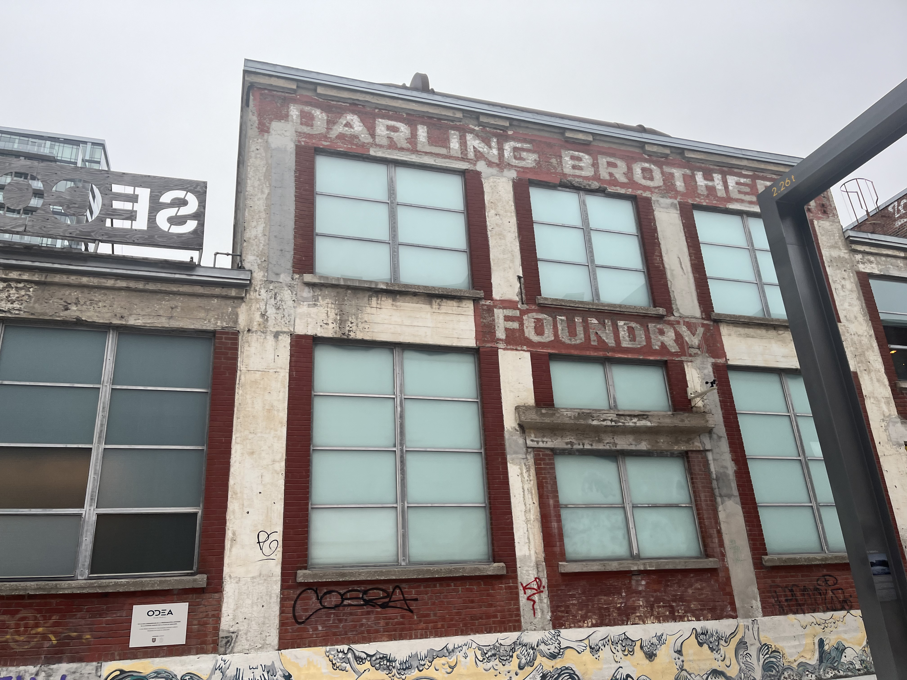
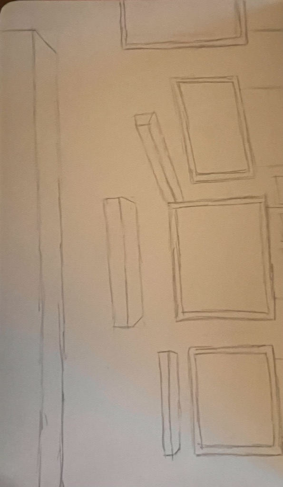

# Nom de l'exposition
PHASE SHIFTING INDEX / JEREMY SHAW

# Lieu de mise en exposition
PRÉSENTÉ PAR LE MUSÉE D'ART CONTEMPORAIN DE MONTRÉAL À LA FONDERIE DARLING

# Type d'exposition
Temporaire, intérieure, multimédias
Vaste installation vidéo immersive à sept canaux

# Date de ma visite
31 Janvier 2024 à 14h30

# Nom de l'artiste
JEREMY SHAW

# Année de réalisation
Phase Shifting Index a été créée au Centre Pompidou à Paris en 2020 et a fait une tournée au Frankfurter Kunstverein, en Allemagne ; Musée d'art Kumu, Estonie ; ARoS Art Museum, Danemark, et Museum of New and Old, Tasmanie.

# Titre de l'oeuvre
Phase Shifting Index [Index d’états de transition] de Jeremy shaw

# Mise en espace

# Composantes et techniques

# Éléments nécessaires à la mise en exposition

# Expérience vécue
L'exposition Jeremy Shaw est une exposition à propos de la transcendance spirituelle comme si c'était dans le futur. Le createur de l'oeuvre est Jeremy Shaw. J'ai bien aimé l'experience de l'exposition parce que c'était complet, bien travaillé et facile à prendre des notes. C'est comme si on m'a fait vivre l'expérience relaxante.

# ❤️ Ce qui m'a plu

# 🤔 Aspect que je souhaite pas retenir pour mes propres créations ou que je ferez autrement et justifications

