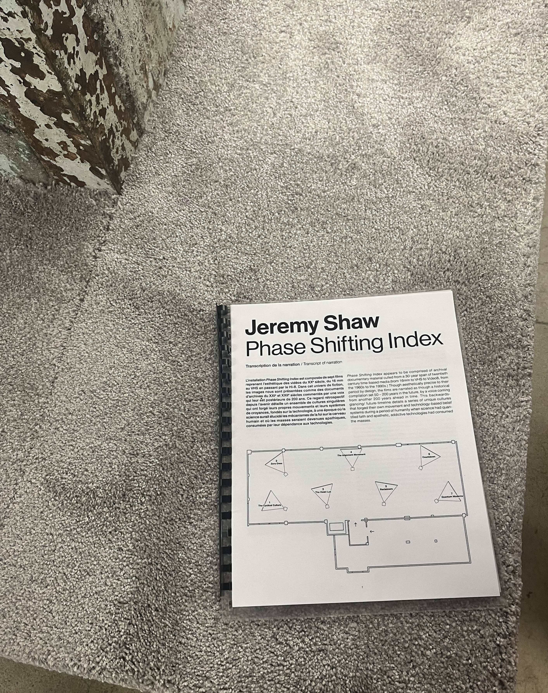
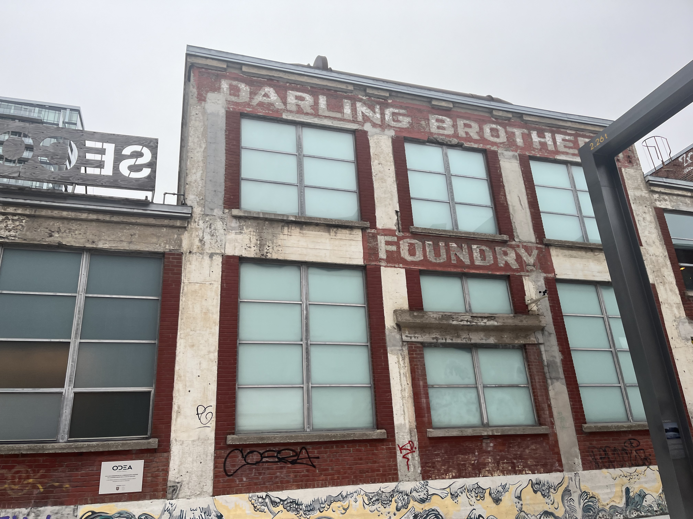
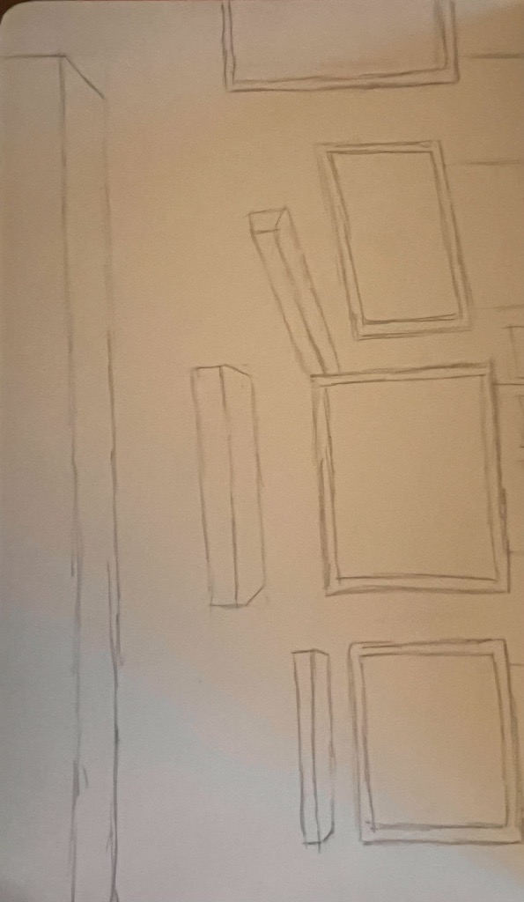
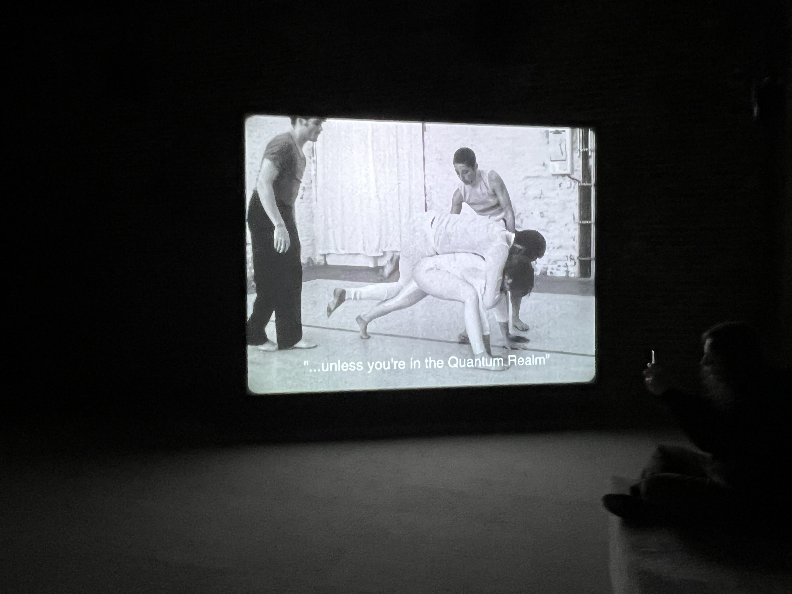
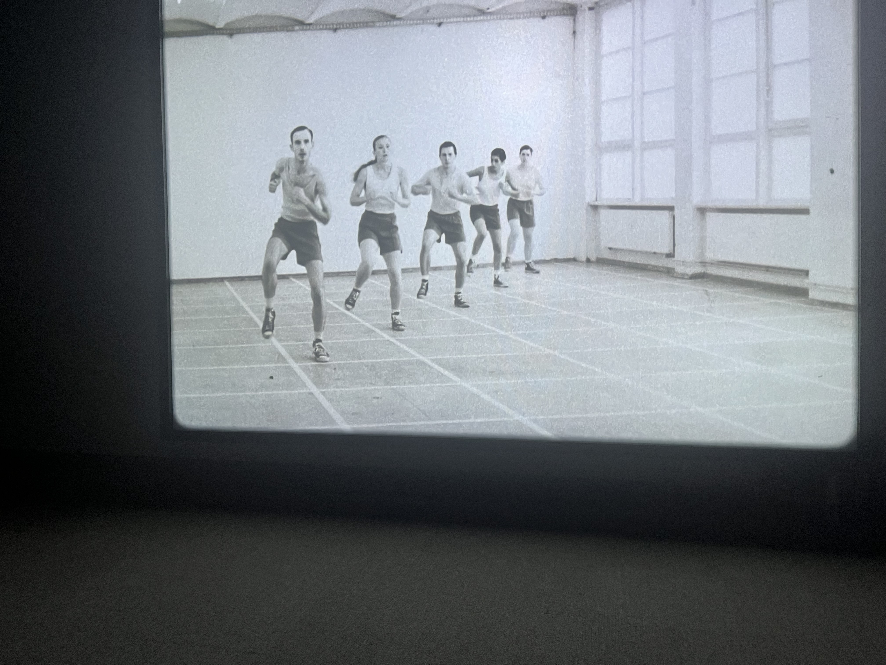

# Nom de l'exposition
PHASE SHIFTING INDEX / JEREMY SHAW

# Lieu de mise en exposition
PRÉSENTÉ PAR LE MUSÉE D'ART CONTEMPORAIN DE MONTRÉAL À LA FONDERIE DARLING

# Type d'exposition
Temporaire, intérieure, multimédias
Vaste installation vidéo immersive à sept canaux

# Date de ma visite
31 Janvier 2024 à 14h30

# Titre de l'oeuvre
Phase Shifting Index [Index d’états de transition]

# Nom de l'artiste
JEREMY SHAW

# Année de réalisation
Phase Shifting Index a été créée au Centre Pompidou à Paris en 2020 et a fait une tournée au Frankfurter Kunstverein, en Allemagne ; Musée d'art Kumu, Estonie ; ARoS Art Museum, Danemark, et Museum of New and Old, Tasmanie.

# Description de l'oeuvre
- Vaste installation vidéo immersive à sept canaux
- Type rêverie parascientifique exaltante
- Ressemble à une étude anthropologique d’un futur lointain
- Narration rétrospective
- Émergence de nouvelles réalités déconcertantes
- Images d’archives de divers groupes de thérapie par le mouvement des années 60 aux années 90 

# Type d'installation
- Installation sur des railles fixes
- Un tableau par écran
- 7 écrans (6 et un qui fonctionne pas)
- Projections sur écrans

↓ cliquez pour visonner video youtube ↓

# Mise en espace

# Composantes et techniques
- Thèmes: spirituel, danses, méditations
- Changement de plan sur écrans, effets pixels
- Sons: (whoosh) genre de rave mais relaxante
- Rétro vintage année 1980, musiques sans paroles (whites noise)
- Flash: changement musique par rapport au flash des écrans, très calme (stroboscopique)
- Mouvements de types rituels et cathartiques

↓ cliquez pour visonner video youtube ↓

# Éléments nécessaires à la mise en exposition

- Projections liées, même chorégraphie
- Chorégraphies filmées dans le passé
- Science fiction narration comme si c’était dans le futur
- Exécuté dans les séquences diffusées simultanément sur des écrans indépendants
- Changement de la musique sur effet pixels - effet psychédélique
- Recherche d’une trans spirituelle (transcendance)

# Expérience vécue
L'exposition Jeremy Shaw est une exposition à propos de la transcendance spirituelle comme si c'était dans le futur. Le createur de l'oeuvre est Jeremy Shaw. J'ai bien aimé l'experience de l'exposition parce que c'était complet, bien travaillé et facile à prendre des notes. C'est comme si on m'a fait vivre l'expérience relaxante.
- Faire vivre les spectateurs par c’est corégraphies et en les faisant s’asseoir

↓ cliquez pour visonner video youtube ↓

# ❤️ Ce qui m'a plu
- Danse, relaxante, avec émotions, un peu agressivité
- Technique d'écrans accrochés par des railles
- Méditations, prendre ça relax, un genre de yoga, connection spirituelle
- Révélation du futur, trouver les moyens par la méditation

↓ cliquez pour visonner video youtube ↓

# 🤔 Aspect que je souhaite pas retenir pour mes propres créations ou que je ferez autrement et justifications
- Certaines scènes sensuelles n'avaient pas vraiment leur place
