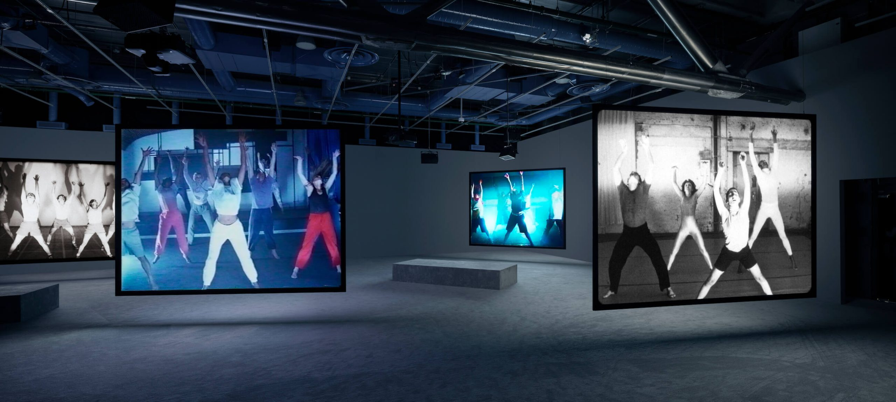
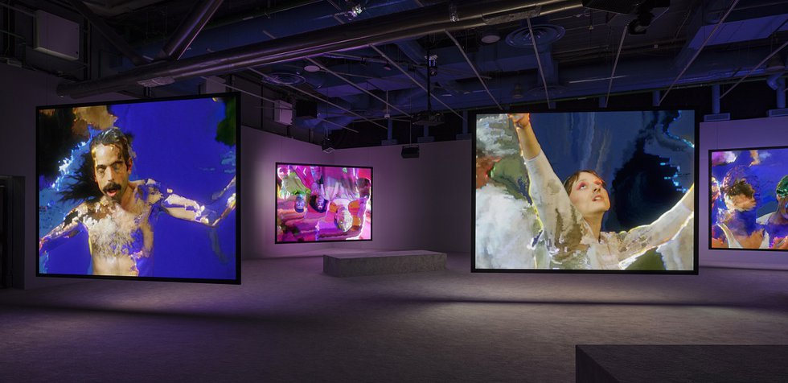
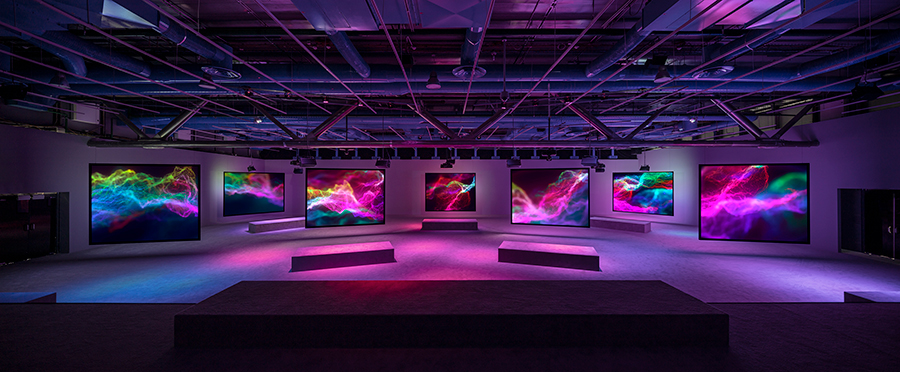

# Nom de l'exposition
PHASE SHIFTING INDEX / JEREMY SHAW

# Lieu de mise en exposition
PRÉSENTÉ PAR LE MUSÉE D'ART CONTEMPORAIN DE MONTRÉAL À LA FONDERIE DARLING

# Type d'exposition
Temporaire, intérieure, multimédia
Vaste installation vidéo immersive à sept canaux

# Date de ma visite
31 Janvier 2024 à 14h30

# Titre de l'oeuvre
Phase Shifting Index [Index d’états de transition]

# Nom de l'artiste
JEREMY SHAW

# Année de réalisation
Phase Shifting Index a été créée au Centre Pompidou à Paris en 2020 et a fait une tournée au Frankfurter Kunstverein, en Allemagne ; Musée d'art Kumu, Estonie ; ARoS Art Museum, Danemark, et Museum of New and Old, Tasmanie.

# Description de l'oeuvre
- Vaste installation vidéo immersive à sept canaux
- Type rêverie parascientifique exaltante
- Ressemble à une étude anthropologique d’un futur lointain
- Narration rétrospective
- Émergence de nouvelles réalités déconcertantes
- Images d’archives de divers groupes de thérapie par le mouvement des années 60 aux années 90 

# Type d'installation
- Installation sur des railles fixes
- Un tableau par écran
- 7 écrans (6 et un qui fonctionnait pas)
- Projections sur écrans

↓ cliquez pour visonner video youtube ↓

# Mise en espace
- Bancs pour s'asseoir et contempler les écrans
- Musiques et sons à volume élevé
- Espaces sombres éclairés uniquement par les écrans

# Composantes et techniques
- 7 écrans larges
- Projecteurs et ordinateurs connectés
- Système sonore
- Disposition des bancs couverts de tapis choisis par l'artiste dans toute la salle
  
↓ cliquez pour visonner video youtube ↓

# Éléments nécessaires à la mise en exposition
- Structure métallique solide pour tenirles écrans
- Projecteurs et spots lumineux fixés au plafond
- Cablages bien couverts
- Dispositions pour éviter les saleté de l'hivers (couvre-pieds)

# Expérience vécue
L'exposition de Jeremy Shaw est une experience de transcendance spirituelle, comme si on voyagais dans le futur. Le createur de l'oeuvre a fait un travail immersif complet au niveau du son, du viuel et de l'émotion. 

- Vivre l'expérience relaxante 
- Observer des chorégraphies parfois bizarres
- Thèmes: spiritualité, danses, méditations
- Changement de plan sur écrans, effets pixels
- Sons: (whoosh) genre rave mais relaxante
- Rétro vintage année 1980, musiques sans paroles (white noise)
- Flash: changement musique par rapport au flash des écrans, parfois calme et parfois stroboscopique
- Mouvements de types rituels
- Science fiction narration comme si c’était dans le futur
- Exécuté dans les séquences diffusées simultanément sur des écrans indépendants
- Effet psychédélique
- Recherche d’une trans spirituelle (transcendance)

↓ cliquez pour visonner video youtube ↓

# ❤️ Ce qui m'a plu
- Danses relaxantes, émotions douces mélangé avec une certaine agressivité
- Technique d'écrans accrochés par des railles
- Méditations, prendre ça relax, un genre de yoga, connection spirituelle
- Révélation du futur, trouver les moyens par la méditation

↓ cliquez pour visonner video youtube ↓

# 🤔 Aspect que je souhaite pas retenir pour mes propres créations ou que je ferez autrement et justifications
- Certaines scènes sensuelles n'avaient pas vraiment leur place
