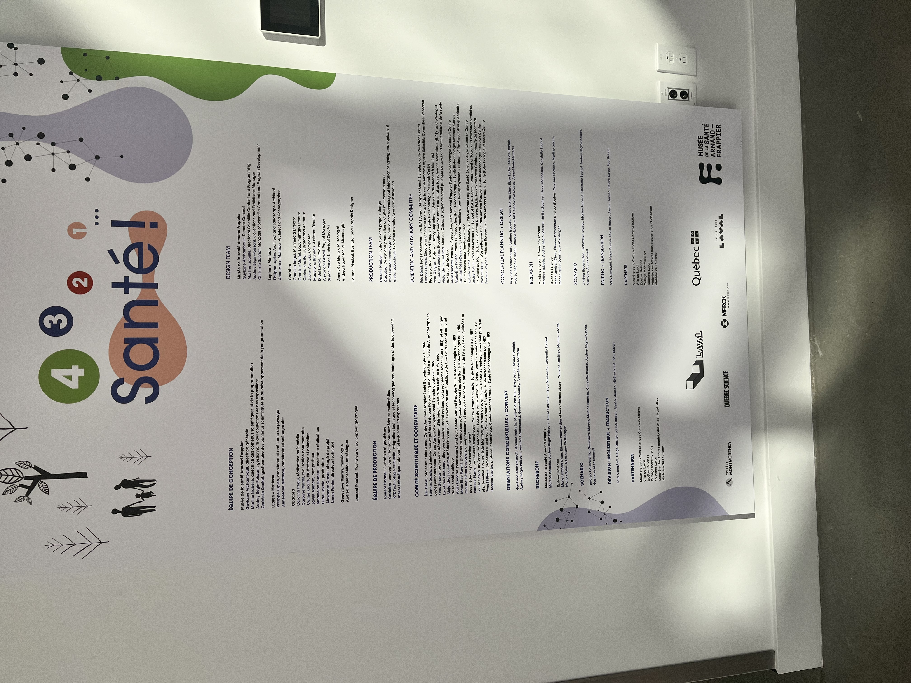
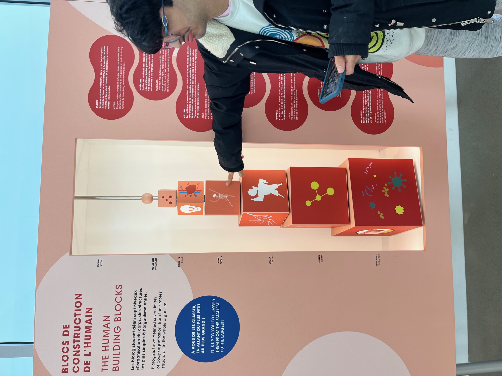
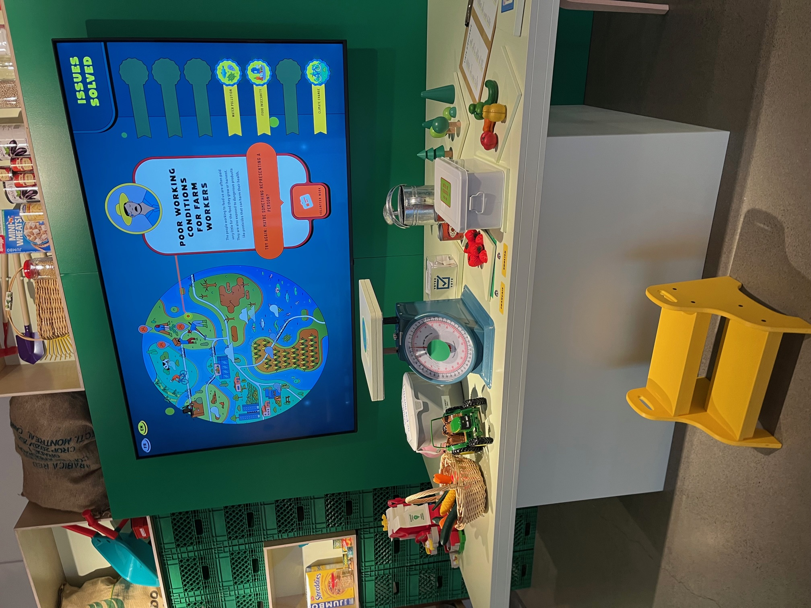
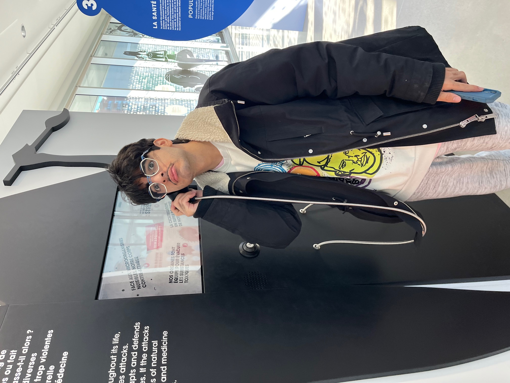
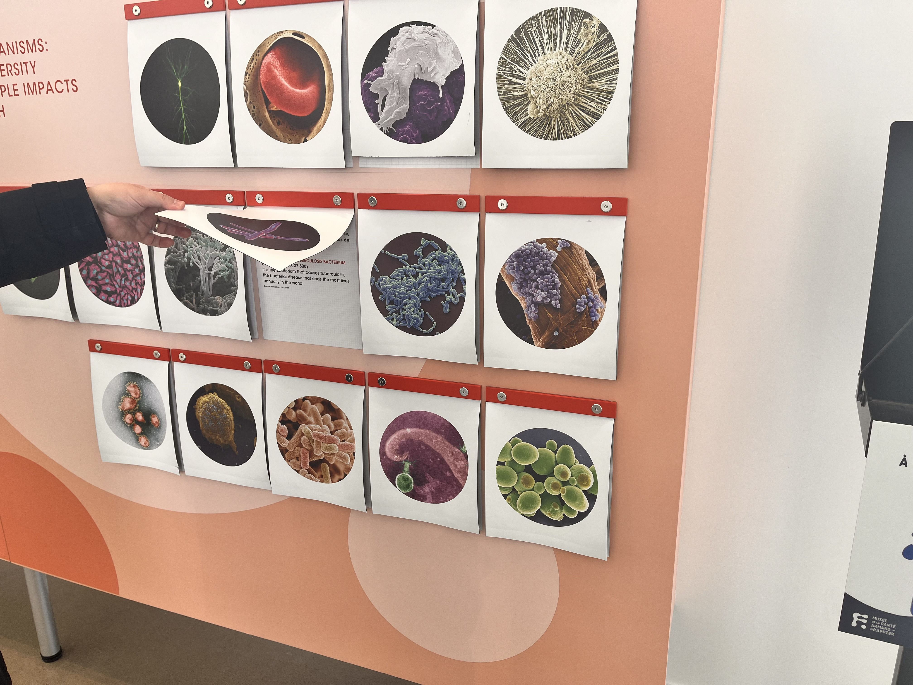
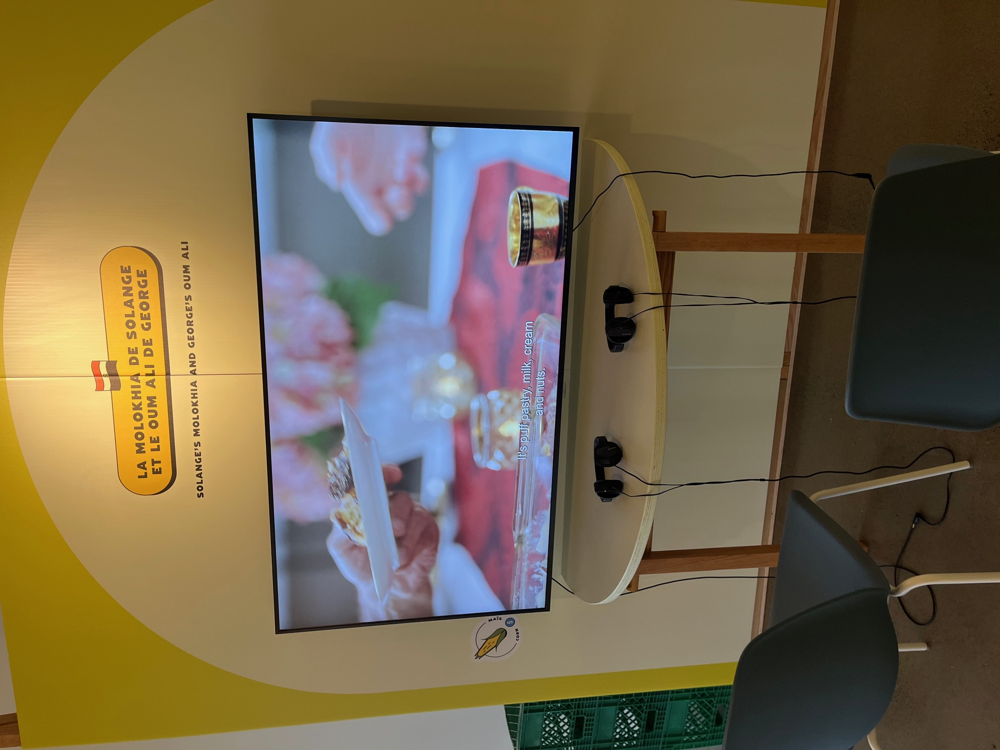
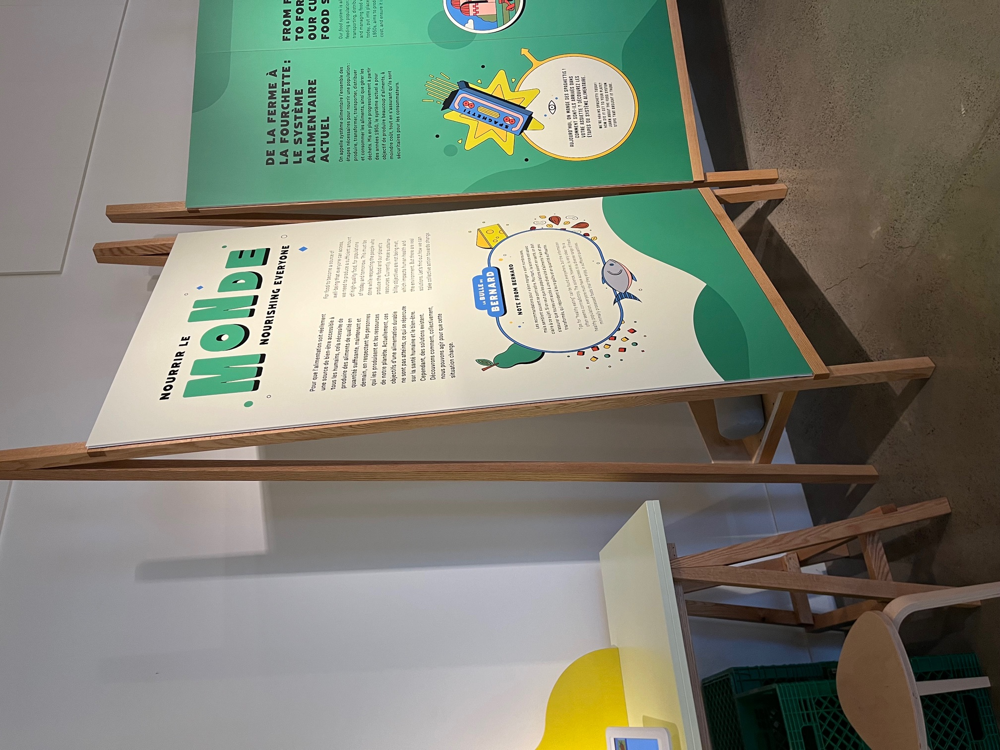
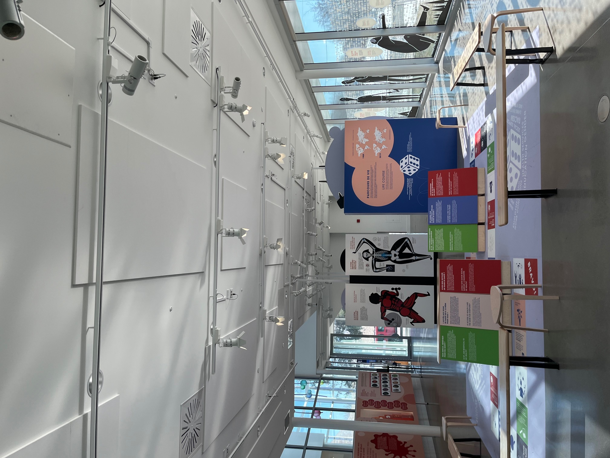
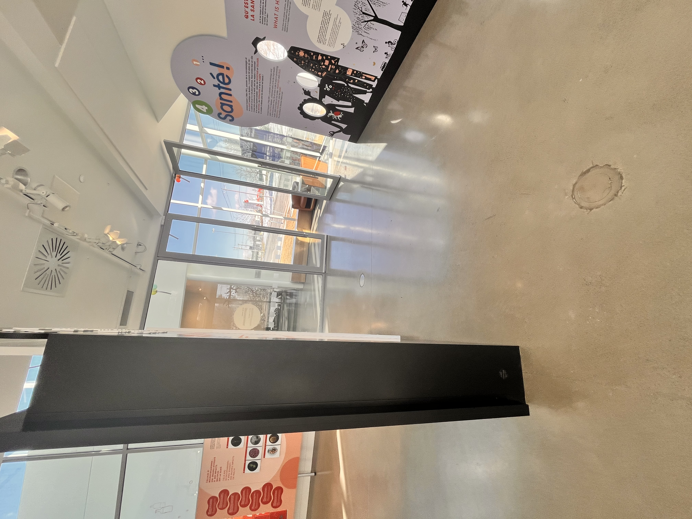
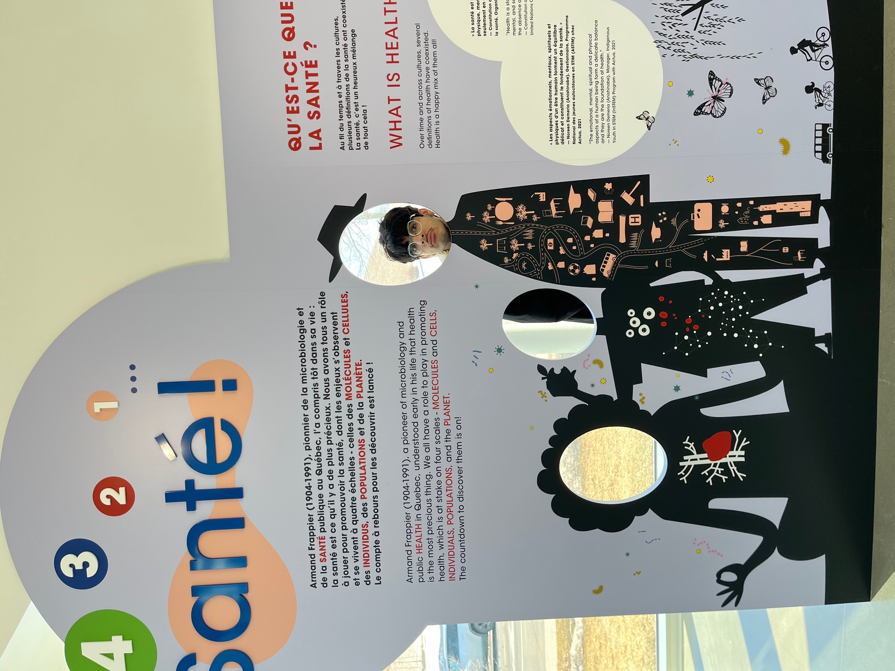

# Nom de l'exposition
1, 2, 3, 4 Santé

Photo prise par Mateo El-Helou durant l'expo

# Lieu de mise en exposition
 Musée Armand-Frappier à Laval

Photo prise par Mateo El-Helou durant l'expo

# Type d'exposition
Temporaire, intérieure, multimédia
Vaste installation vidéo immersive à sept canaux

# Date de ma visite
Le Lundi 26 Février 2024

# Titre de l'oeuvre
1, 2, 3, 4 Santé

# Nom de l'artiste
⁃ Armand Frappier

# Année de réalisation
Du 31 janvier 2023 

# Description de l'oeuvre
Sujet: la santé et la nutrition

- Grand écran qui montre des informations sur le gaspillage alimentaire
- Écrans qui montre quelques recettes de différents pays

  Interactions
- Informations sur l’utilisation des nutriments parle corps humain
- Informations sur la digestion des aliments
- Informations sur l’alimentation une source de bien être
- interactions sur l’ouïe (interactions alimentaires (les 5 sens: l’odorat, le goût, le toucher)
- Interactions sur du duvet dès la nourriture
- Jeux interactifs aussi
- Interactions sur les nerfs du système du corps humain dont le système urinaire, reproducteurs, endocriniens, digestifs: la transformation, système musculaire et le système squelettique: structure et protection

- vidéos avec des des écouteurs
- Photos sur miscroscope
- Projections sur le murs avec du son, papier peint
  

 
- information sur les différents bactéries qu'il peut y avoir 

# Type d'installation
- écouteurs
- écrans
⁃ Écrans tactiles
- projecteurs,
- lumières
- stand portant les tableaux
  

Photos prise par Mateo El-Helou durant l'expo

# Mise en espace

# Composantes et techniques

# Éléments nécessaires à la mise en exposition

  

# Expérience vécue

Photo prise par Mateo El-Helou durant l'expo

# ❤️ Ce qui m'a plu

- Les différentes interactions
- des faits interessants sur le corps human dont notamment le système du corps humain dont le système urinaire, reproducteurs, endocriniens, digestifs: la transformation, système musculaire et le système squelettique: structure et protection
- vidéos interessants
- les information surla santé dont notamment la digestion des aliments et l'utilisation des nutriments par le corps humains
- Un jeu de sepent echèlle  grandeur nature version mais dans le thème de la santé et du corps humain

↓ cliquez pour visonner video youtube ↓

Vidéo prise par Mateo El-Helou durant l'expo

# 🤔 Aspect que je souhaite pas retenir pour mes propres créations ou que je ferez autrement et justifications

Je souhaite ne pas retenir les type de bactéries qu'il peut y avoir

