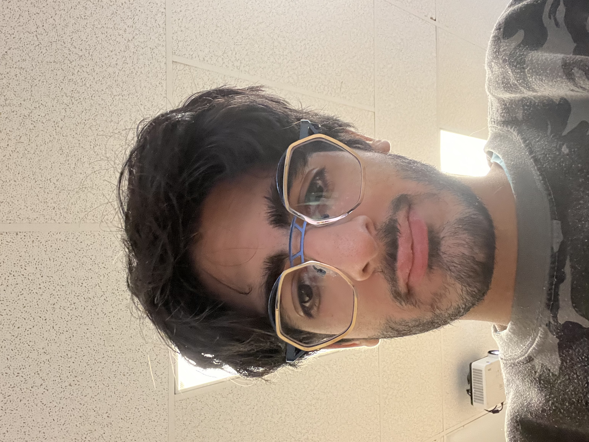

# Mateo El-Helou

## **Intérêts dans le multimédia**
J'aime particulièrement les oeuvres d'art parce que 'aime bien tout ce qui est de l'art numétrique et j'ai toujpours apprécié le projet d'oeuveres d'art numérique et c,est pour cela que je je voit autant de ces projets, et plus tard un jour peut être moi aussi je voudrai faire un projet d'oeuvre numérique. J,ai bien aussi tout ce qui est informatique apart oeuvres et exposition j'ai une passion pour ça.

## Ce qui me plaît dans l'introduction à la muséologie en TIM
En apprendre plus sure ces projet d'euvres numérique par exemple dans des centre d'art numériue ou des musées même. et ensuite partage mon expérience de ces oeuvres numériques là au autre pour peut etre les intéresser a venir les voir et apprendre aussi les coomposantes numérique pour un jour si je veux créer ma propre oeuvre numérique que je sache bien comment faire de mon mieix pour dire exactement.
